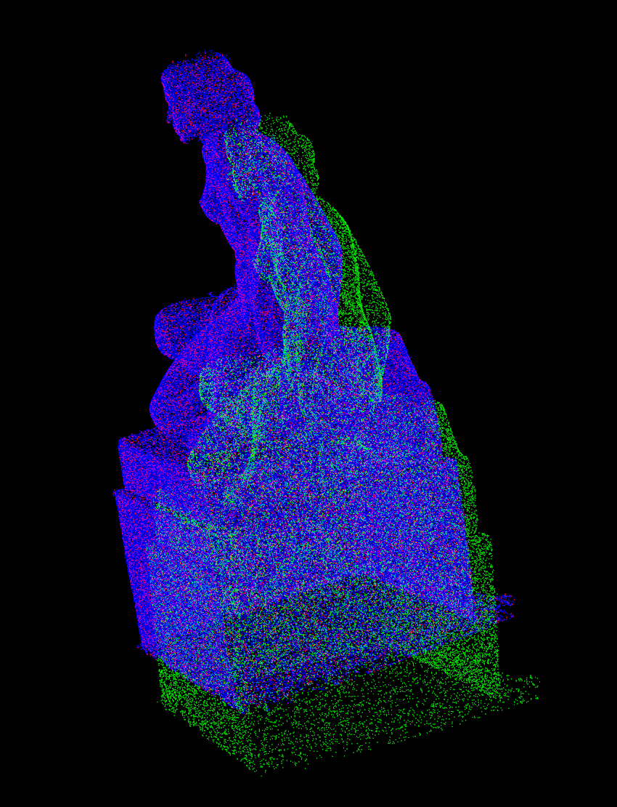
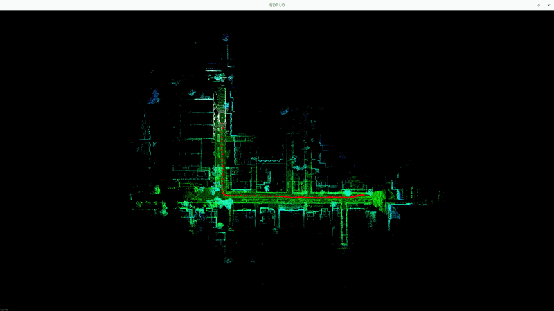
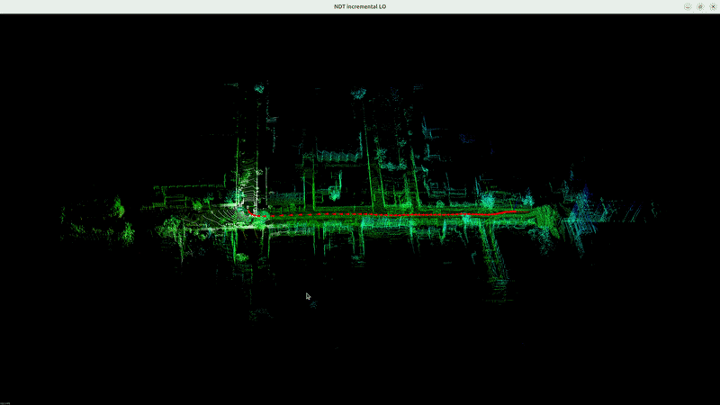
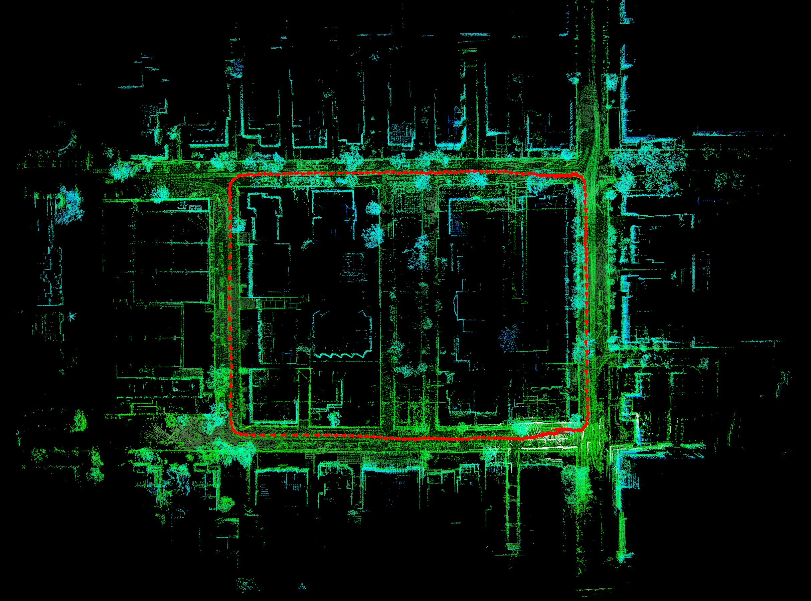
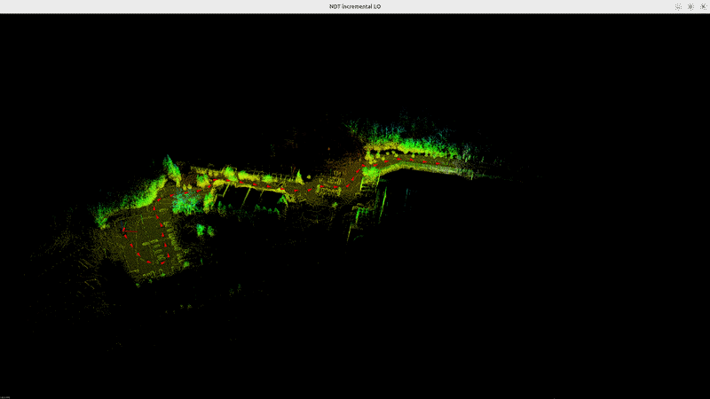
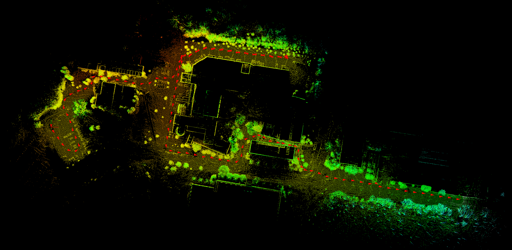
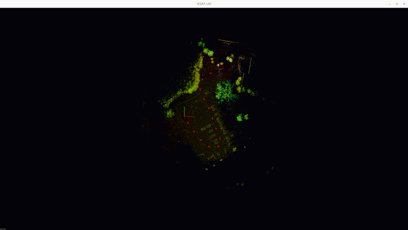

## 3D Lidar Odometry

### Components

- Point Cloud Registration:
  - Normal Distribution Transform (NDT)
  - Incremental NDT
  - ICP
- Lidar odometry based on NDT alignment
- Lidar-Inertial Odometry based on Error State Kalman Filter (ESKF) and incremental NDT alignment
- LIO based on Iterative ESKF

### Point Cloud Registration

Probelm statement: given target and source point cloud, compute pose where source cloud is observed relative to pose where target cloud is observed.

#### NDT

1. Given target point cloud, build the grid which contains the cloud. Compute the mean and covariance of position of points for each grid cells say $\mu_i$, $\Sigma$.
2. Given source point cloud, formulate least squared problem:
   - $\text{min} \ \sum_i ||R * p_{si} + t - p_{ti}||_{\Sigma_i}$
3. Solve least square problem by Gauss-Newton method:
   - Jacobian: $J_i = [ -R \hat{p}_{si}, \ I_3 ] \in 3 \times 6$
   - Error: $e_i = R  p_{si} + t - p_{ti}$
   - solve iteratively: $J_i^T \Sigma_i ^{-1} J_i \cdot \Delta x = -J_i^{T} \Sigma_i^{-1} e_i$
   - update: $x = x + \Delta x$
4. Solution is the optimized pose $x^* = [R^*, t^*]^T$
5. C++ parallel algorithm is used to accelerate optimization.

- code
  - [source code](src/matching/NDT.cpp)
  - [unit test](test/ndt_test.cpp): `./test/ndt_test`

  - blue: target cloud, green source cloud, red: aligned cloud.

      

#### Incremental NDT

Goal: Build target grid incrementally, limit number of voxel cells, accelerate alignment.

1. Update mean and variance incrementally, i.e.,
   - mean: $\mu_{n} = \frac{m * \mu_{h} + n * \mu_{c}}{m + n}$
   - covariance: $\Sigma_{n} = \frac{m *(\Sigma_h + (\mu_h - \mu_n) * (\mu_h - \mu_n)^T) + n * (\Sigma_c + (\mu_{c} + (\mu_c - \mu_n)(\mu_c - \mu_n)^T) )}{m + n}$
2. Limit number of grid cell and delte cells that are not updated for a long time. A LRU cache is implemented for this purpose.
3. To have better numerical stability, the inverse of covariance matrix, i.e., information matrix is computed by SVD.

- code
  - [source code](src/matching/NDT_INC.cpp)

#### ICP 3D

- kd-tree is implemented to find the nearest neighbors.

- point to point
  - for each source point, find the nearest neighbor from target cloud with kd-tree, denote $p_{si}$ query point from source cloud, $p_{ti}$ the closest point in target cloud.
  - solve least square problem: min $\sum_i ||R * p_{si} + t - p_{ti}||$
  - Gauss-Newton iteration with same Jacobian and residual defined in NDT.
  - After each iteration, find again the nearest neighbor for each source point.

- point to line
  - for each source point, find the nearest k neighbors, and fitting a line from them, i.e., $p = s_0 + \lambda d$.
  - solve least square problem: min $\sum_i || \hat{d} (R p_i + t - s_0) ||$.
  - Jacobian: $[-\hat{d} R \hat{p}_i, \ \hat{d}] \in 3 \times 6$
  - Go back to the first step until converge

- point to plane
  - for each source point, find the nearest k neighbors and the corresponding fitting plane, i.e., $n^T p_i  + d = 0$
  - solve least square problem: min $\sum_i n^T (R p_i + t) + d$
  - Jacobian: $[-n^T R \hat{p}_i, \ n^T] \in 1\times 6$
  - go back to the first step until converge

- [source code](src/matching/ICP3D.cpp)
- [unit test](test/icp_test.cpp): `./test/icp_test`

### Lidar Odometry

Goal: given pointcloud, estimate global pose at each timestamp.

#### Procedure

1. Set origin of global frame as the pose of first keyframe.
2. At each time stamp, add source pointcloud to NDT.
3. Compute initial guess of current pose by integrating last relative motion to the pose of last frame. Solve NDT alignment. The solution is the global pose of current frame.
4. Create keyframe if the motion between current frame and last keyframe is greater than a threshold. Update target cloud of NDT.
5. Compute the relative motion from last to current frame. Store the estimated pose for the next iteration.

#### Code

- NDT LO
  - [source code](src/lio/ndt_lo.cpp)

  - [unit test](test/ndt_lo_test.cpp): `./test/ndt_lo_test`

  

- Incremental NDT LO
  - [source code](src/lio/ndt_inc_lo.cpp)

  - [unit test](test/ndt_inc_lo_test.cpp): `./test/ndt_inc_lo_test`

  

### ESKF Lidar-Inertial Odometry

Goal: Estimate the state of robot at each timestamp by loosely fusing lidar scan and IMU data.

#### Procedure

1. Initialize IMU by integrating gyroscope and accelerometer readings while the robot keeps static. Compute bias and covariance of gyroscope and accelerometer, gravity, which are used in ESKF.
2. Predict nominal state by IMU integration. Nominal state includes: position, velocity, rotation, bias of gyroscope, bias of accelerometer, gravity (dim: 18 by 1). Error state remains zero. Covariance matrix also gets updated (dim: 18 by 18).
3. Undistort lidar scan influenced by motion. The undistortion computes the global pose of lidar sensor when scan point is observed ($T_{WLi}$) by interoplating imu poses, and then transform scan point to the last imu reading ($p_{Le}$). More precise $p_{Le} = T_{LI} * T_{IeW} * T_{WIi} * T_{IL} * p_{Li}$
4. Correct state of ESKF from observation. The observation is the difference between global pose estimated from NDT alignment and the predicted nominal pose by ESKF. ESKF state is updated from Kalman gain and innovation. Then the error state is reset to 0 and covariance get updated.
5. Create keyframe if the relative motion to last keyframe is over the threshold. The target cloud of NDT is also updated.

#### Code

- [source code](src/eskf/LioEskf.cpp)
- [unit test](test/eskf_test.cpp): `./test/eskf_test`

  

### Iterative ESKF Lidar-Inertial Odometry

Goal: Estimate the state of robot at each timestamp by tightly fusing lidar scan and IMU data. In loosely LIO, the NDT alignment may fail in degenerate environment, which leads to divergence of eskf estimation. In tightly couple LIO, the NDT algnment residual is used in the observation model of iterative ESKF. NDT alignment is constrained by IMU.

#### Procedure

1. Initialize IMU by integrating gyroscope and accelerometer readings while the robot keeps static. Compute bias and covariance of gyroscope and accelerometer, gravity, which are used in ESKF.
2. Predict nominal state by IMU integration. Nominal state includes: position, velocity, rotation, bias of gyroscope, bias of accelerometer, gravity (dim: 18 by 1). Error state remains zero. Covariance matrix also gets updated (dim: 18 by 18).
3. Undistort lidar scan influenced by motion. The undistortion computes the global pose of lidar sensor when scan point is observed ($T_{WLi}$) by interoplating imu poses, and then transform scan point to the last imu reading ($p_{Le}$). More precise $p_{Le} = T_{LI} * T_{IeW} * T_{WIi} * T_{IL} * p_{Li}$
4. Correct state of iESKF from observation iteratively. In each iteration, compute the residual and Jacobian of NDT alignment based on current state estimation. The Kalman gain and innovation are computed from them. The nominal state and covariance are then updated. Say at j iteration:
   - Let $H_j = \sum_i J_i^T \Sigma_i^{-1}J_i \ \in \mathbb{R}^{18 \times 18}$
   - Let $b_j = \sum_i -J_i^T \Sigma_i^{-1} r_i \ \in \mathbb{R}^{18}$, where $r_i = R * p_{si} + t - p_{ti}$
   - error state $\delta x_{j + 1} = (P_j^{-1} + H_j)^{-1} b_j$
5. Create keyframe if the relative motion to last keyframe is over the threshold. The target cloud of NDT is incrementally updated.

#### Code

- [source code](src/eskf/LioIeskf.cpp)
- [unit test](test/ieskf_test.cpp): `./test/ieskf_test`

  

### Dataset

1. ULHK:

- no time info
- time unit: microseconds
- issue: the scan time is estimated by angular velocity which is not accurate enough. Therefore the start time of a scan is tens of (around 20 ) ms later than the end time of previous scan.
- cloud topic name: /velodyne_points_0
- imu topic name: /imu/data

2. NCLT:

- has time info
- time unit: seconds
- cloud topic name: points_raw
- imu topic name: imu_raw

3. [ICP pointcloud dataset](https://lgg.epfl.ch/statues_dataset.php)

### Issues

1. eskf:
   1. Covariance matrix of motion noise is too small if dt is included, which makes Kalman gain so small that system rely on mainly on IMU prediction.
2. ndt inc:
   1. wrong number of evaluated points, clear points before evaluated: clear and count evaluated points outside of loop.
   2. align optimization: count valid point number in parallel version of for_each function
